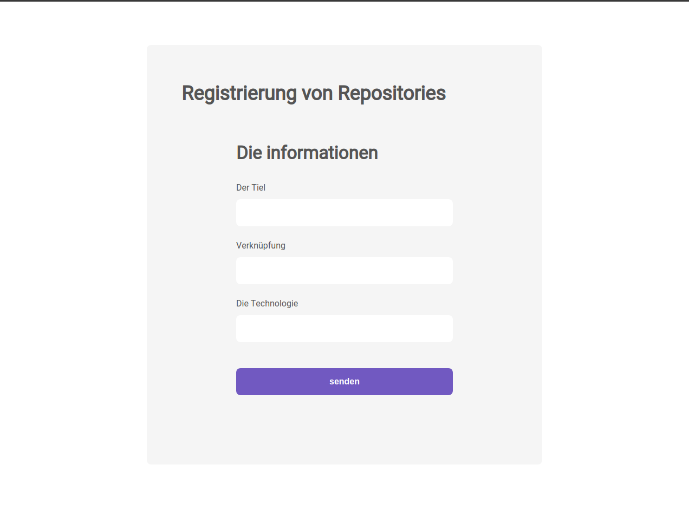

# Github Projects Repository

<p>

  Web: Cadastrar novos repositórios, enviando para a API em Node.

  Mobile: Listar e dar likes nos repositórios que estão salvos na API.

  API: [Link do repositório](https://github.com/ArielKollross/Challenge-02-gostack-template-conceitos-nodejs)
</p>

<h1 align="center">
  
</h1>

### 🎲 Rodando Aplicativo web

```bash
# Clone este repositório
$ git clone git@github.com:ArielKollross/Github-Projects-Repository.git

# Acesse a pasta do projeto no terminal/cmd
$ cd web

# Instale as dependências
$ yarn

#ou com npm
$ npm install

# Execute a aplicação 
$ yarn start
# ou com npm
$ npm start
```